# Programming-related SVG logos

A curated collection of SVG logos for developers/DevOps/geeks. Over 200 Free SVG icons for popular programming-related technologies and brands. Contributions, corrections & requests can be made on GitHub.

| Title | Image |
| ------------- | ------------- |
| airtable |  |
| akamai |  |
| amazon-web-services |  |
| amp |  |
| android-head |  |
| android |  |
| angular |  |
| ansible | 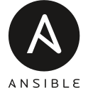 |
| apache-spark |  |
| arduino | 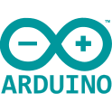 |
| asana |  |
| atlassian | 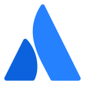 |
| atom |  |
| babel |  |
| bamboo |  |
| bash |  |
| bitbucket-wordmark |  |
| bitbucket |  |
| blender |  |
| bootstrap |  |
| bower |  |
| bun |  |
| c-plus-plus |  |
| c-sharp | 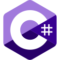 |
| c |  |
| cassandra |  |
| chatgpt |  |
| chrome |  |
| circle-ci |  |
| cloudflare |  |
| coffeescript |  |
| coffescript-wordmark |  |
| css |  |
| dart-wordmark |  |
| dart |  |
| discord-square |  |
| discord |  |
| django-wordmark |  |
| django |  |
| docker-simple |  |
| docker |  |
| docusaurus |  |
| dot-net-core |  |
| dot-net-letter |  |
| dropbox |  |
| elixr |  |
| eslint | 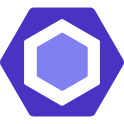 |
| expo |  |
| figma |  |
| firebase-wordmark |  |
| firebase |  |
| flask-circle |  |
| flask-wordmark |  |
| flask |  |
| flow |  |
| flutter-wordmark |  |
| flutter |  |
| gatsby |  |
| gimp |  |
| git-wordmark |  |
| git |  |
| github-actions |  |
| github-circle |  |
| github-head |  |
| github-octocat |  |
| github-wordmark |  |
| gitlab-old |  |
| gitlab-wordmark |  |
| gitlab |  |
| go-gopher | 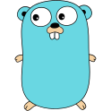 |
| go-wordmark |  |
| google-cloud-platform |  |
| google-cloud |  |
| google-developer |  |
| google-lighthouse |  |
| grunt-wordmark |  |
| grunt |  |
| gulp |  |
| heroku-circle |  |
| heroku |  |
| hexo |  |
| homebrew |  |
| hostgator |  |
| html |  |
| hugging-face |  |
| intellij |  |
| java-wordmark |  |
| java |  |
| javascript-shield |  |
| javascript |  |
| jekyll |  |
| jenkins |  |
| jest |  |
| jquery |  |
| json-web-token |  |
| kafka-wordmark |  |
| kafka |  |
| kotlin-wordmark |  |
| kotlin |  |
| kubernetes |  |
| laravel | 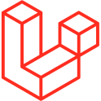 |
| leetcode |  |
| linode |  |
| linux-tux |  |
| lua-black |  |
| lua |  |
| mailchimp |  |
| markdown-black |  |
| markdown |  |
| material-ui | 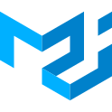 |
| metamask |  |
| microsoft-azure |  |
| mongo-db-circle |  |
| mongo-db-leaf |  |
| mongo-db-shield |  |
| mongo-db-wordmark |  |
| mysql |  |
| neo4j-wordmark |  |
| neo4j |  |
| nestjs |  |
| netlify |  |
| nextjs |  |
| nginx-octagon |  |
| nginx-wordmark |  |
| nodejs-circle |  |
| nodejs-shape | 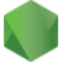 |
| nodejs-wordmark |  |
| nodejs |  |
| notion |  |
| npm | 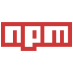 |
| open-source |  |
| oracle |  |
| perl |  |
| photoshop |  |
| php |  |
| pnpm |  |
| postgresql-wordmark |  |
| postgresql |  |
| prettier |  |
| prisma |  |
| pycharm |  |
| pygame |  |
| python | 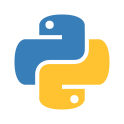 |
| pytorch |  |
| rabbitmq-wordmark |  |
| rabbitmq |  |
| rails |  |
| raspberry-pi | 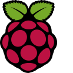 |
| react-hexagon |  |
| react-native |  |
| react |  |
| reddit-head |  |
| reddit |  |
| redhat-wordmark |  |
| redhat |  |
| redis |  |
| redux |  |
| ruby-on-rails |  |
| ruby |  |
| rust | 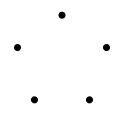 |
| rustacean |  |
| salesforce |  |
| sap |  |
| sass |  |
| scala-wordmark |  |
| scala |  |
| slack |  |
| spring-io |  |
| spring |  |
| sql |  |
| sqlite-wordmark |  |
| sqlite |  |
| stack-overflow-circle |  |
| stack-overflow |  |
| stripe-letter |  |
| stripe |  |
| sumblime-text-circle |  |
| sumblime-text-letter |  |
| sumblime-text |  |
| supabase-wordmark |  |
| supabase |  |
| svelte |  |
| swift-wordmark |  |
| swift |  |
| tailwind-css |  |
| tensorflow |  |
| tomcat | 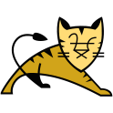 |
| tor |  |
| twillio-wordmark |  |
| twillio |  |
| twitch |  |
| typescript |  |
| ubuntu |  |
| unity-wordmark |  |
| unity | 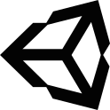 |
| vercel-triangle |  |
| vercel-wordmark |  |
| vim |  |
| visual-basic |  |
| vite |  |
| vscode |  |
| vuejs |  |
| webpack |  |
